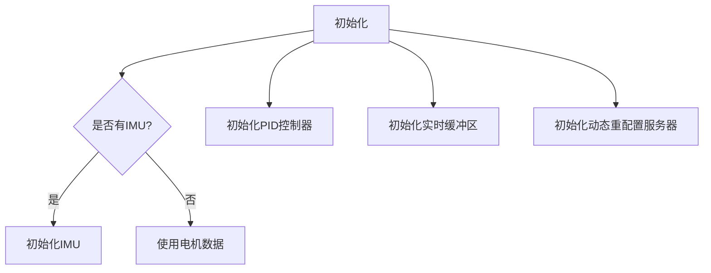
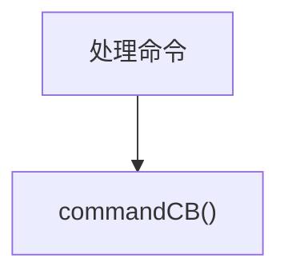
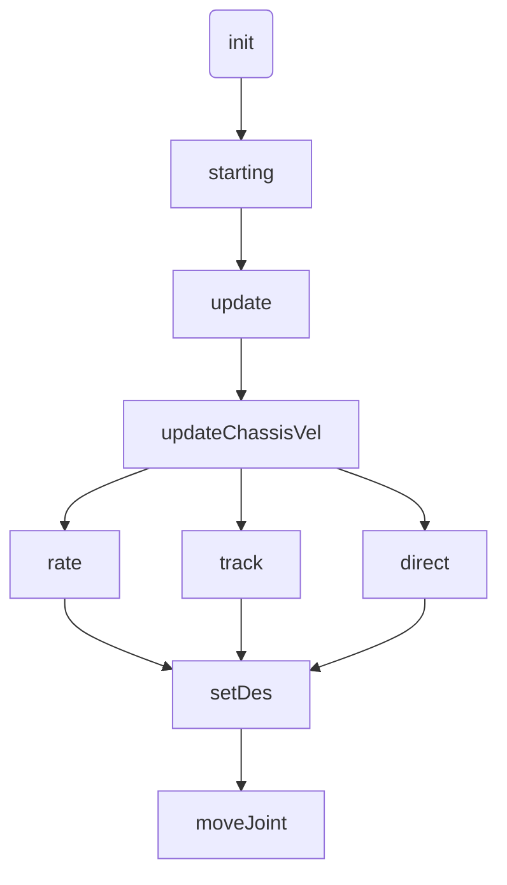

```mermaid
graph TD;
    A[初始化] --> B{是否有IMU?}
    B -- "是" --> C[初始化IMU]
    B -- "否" --> D[使用电机数据]
    A --> E[初始化PID控制器]
    A --> F[初始化实时缓冲区]
    A --> G[初始化动态重配置服务器]

```

```mermaid
graph TD;
P[处理命令] --> Q["commandCB()"]

```

```mermaid
graph TB
    A(init) --> B[starting]
    B[starting]-->d[update]-->e[updateChassisVel]
    e[updateChassisVel]-->f[rate]-->j[setDes]
    e[updateChassisVel]-->g[track]-->j[setDes]
    e[updateChassisVel]-->h[direct]-->j[setDes]
    j[setDes]-->i[moveJoint]
```

