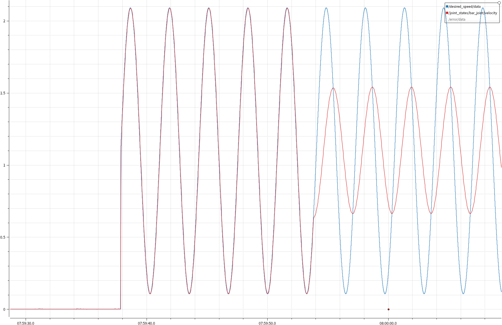
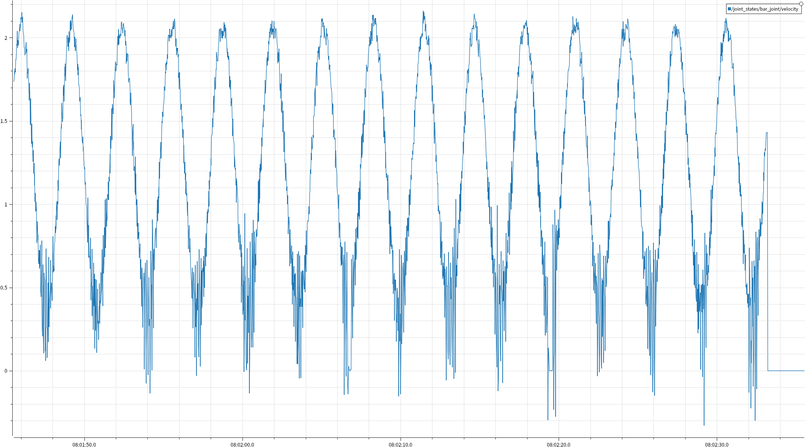
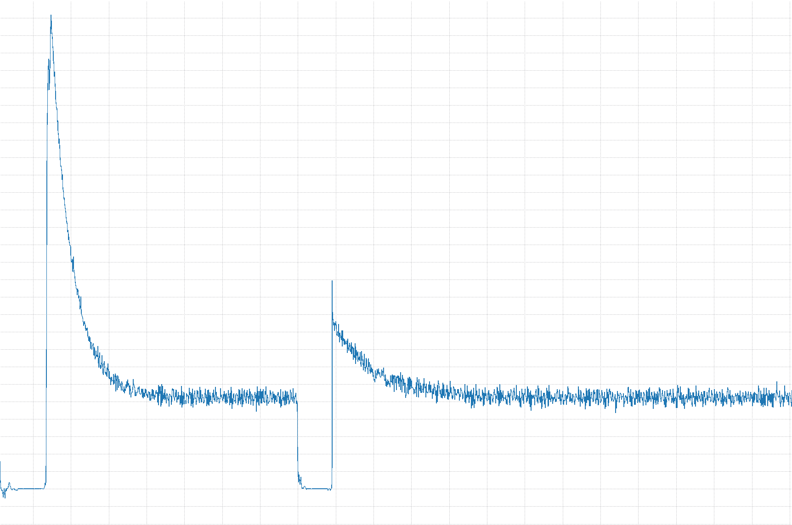

## 前馈+PID风车驱动构建过程

### 实现路线：
- 写URDF
- 实现PID控制
- 实现前馈+PID控制
- 实现如前馈开关，dynamic_reconfigure调参等
### URDF
直接写一个立柱+杆的模型，由于杆质心位于转轴处，只需一个杆即可。没有找到将base_link固定在地面的方式，于是将立柱半径和质量尽量设大，以防止倾倒。
### PID控制实现
参考最终考核控制器，利用control_toolbox编写一个控制风车motor_joint的控制器。首先不进行参数调整，仅使用比例控制器让风车动起来。通过plotjuggler观察发现，仅使用PID控制的响应速度不够快（p_gain=100），需要大约转一圈半才能达到目标正弦式的速度，但实测p_gain=10000, i_gain=1时响应极快，误差也很小（绝对误差数量级10e-3），应该是urdf中杆的质量大的问题。
### 前馈实现
为了体现前馈对响应速度的提升，将p_gain设为100，利用公式$$u_{ff}=k*\text{error} $$调整$$k$$值，以提高响应速度。
### 调参
在仿真中：进行参数调整，以优化前馈+PID控制效果。

前面为开启前馈，后面为关闭前馈

蓝色为目标速度，红色为实际速度

在实际电机中：

开启前馈后响应更快

